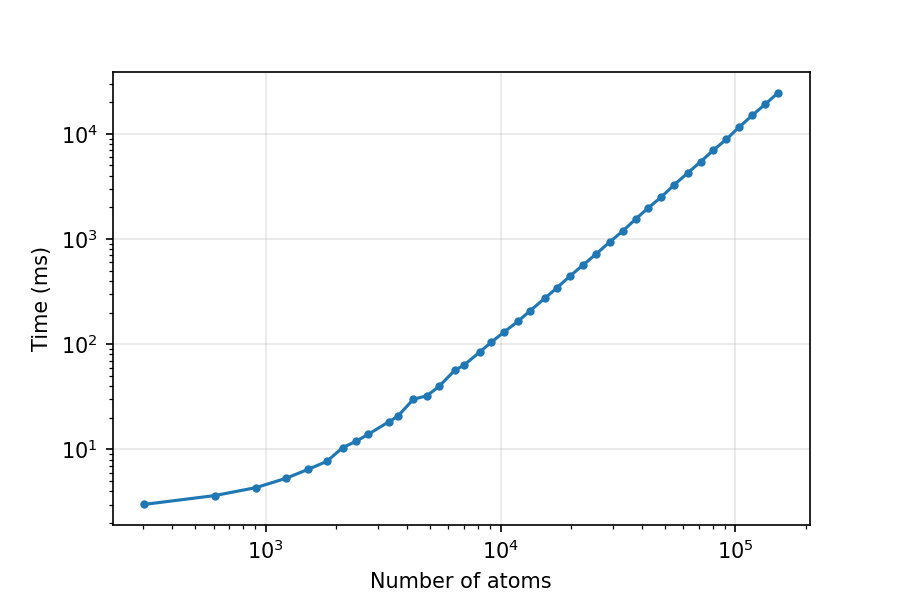

# gpu_xray_scattering
Python package for calculating X-ray scattering on GPU

In this package we modify the XSNAMD package to implement python binding that allows for X-ray scattering calculations using GPUs.

## Install

```bash
cd gpu_xray_scattering
make # Generates bin/XS.so
pip install -e .
```

You need a working nvcc compiler.

## Testing

`python test/test.py`

## Actual usage

Please consult `python examples/1L2Y_example.py`

## Benchmarking

There is an overhead of 2.5 ms per calculation due to matrix copying from host memory to device memory. This becomes negligible when protein size is larger.



Benchmarking shows this code is strictly O(N^2) scaling, which is not good for very large N.
Considering that N could be larger than 1.5e5 atoms, I'm working on a O(QN) method based on orientational averaging.

